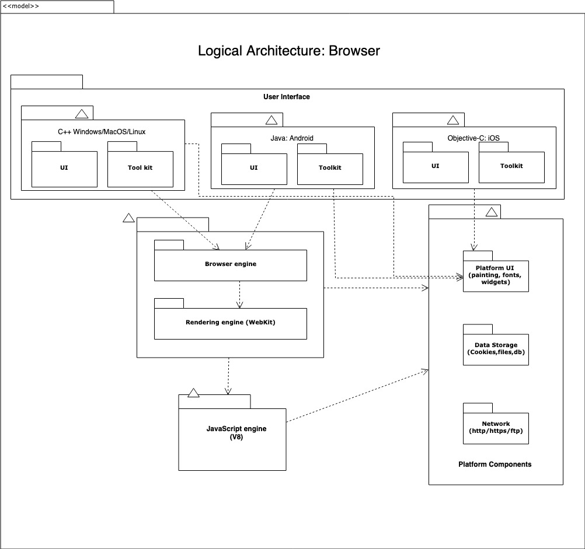
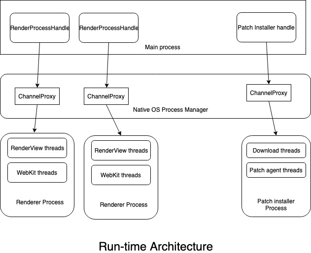

#  Browser application architecture

At its core, a browser needs to be able to fetch, display and navigate informational resources on web. However to support the numerous types of resource on web, many non-functional requirements such as security, performance, usability, extensibility etc., and multiple platform/devices makes this a very complex software.  

Fortunately most of the content types HTML/CSS/JS, images, videos and underneath protocols such http/https/ftp etc., that the browser need to handle are well defined by standards and specification leading to many reusable components that are readily available on market. Essentially a component based architecture best fits for developing the browser and provides the following benefits..
* Reusing the readily available components will lead to less development time and higher reliability. 
* Supports quick iterations as components can be developed and modified with ease without impacting rest of the system
* Team can work independently with less or no change release co-ordination.
* Highly extensible as components can be added or replaced to support new content types or platform. 
* Better productivity and maintainability as engineers can work and contribute on components without needing to worry or understand whole or rest of the system.

## Logical Architecture
At very high level following are the major components of the browser application. All interactions between components should be through interfaces and changes within a component should always backward compatible to allow the components to be developed and modified independently.

### User interface
* Provides the essentials for user to retrieve and navigate the web resources such as address bar, forward/backward navigation, refresh etc., to interact with browser engine.  
* The layer should be implemented using highly portable language such as C++ to target multiple platforms. 
* Platform specific implementation of this layer should be utilized for iOS using Objective-C and Java for android. 
* Utilizing a tool kit approach to build the UI components is essential to allow community to develop extensions and add-ons for the browser. 

### Browser engine
* Mediator between the UI and the rendering engine. Translates the UI action to rendering engine actions and vice versa. 
* Enables loosing coupling between the UI and rendering engine to allow replacing either. As we iterate and evolve this would help us switch or replace the rendering engines. 
* Use highly portable C++/RUST for developing this to support multiple platforms. 

### Rendering engine
* Orchestrates all activities involved in retrieving and rendering the requested resource from the web. 
* A typical work flow involves..
    1. Fetch the HTML using networking engine
    2. Build DOM tree using HTML parser. 
    3. Fetch CSS and build render tree if applies.
    4. Paint the render tree using the platform UI components. 
* Interacts with JS engine to interpret and manipulate the DOM tree when JS is involved. 
* Webkit is a popular open source implementation of the rendering engine that can be leveraged. This helps with speed in time for market and stability. 

### Javascript engine
* Executes the JS code and returns the result.
* V8 is an open source implementation of the JS engine that can be leveraged to build the browser. Saves cost, speed in time to market, high performance and stability. 
 
### Platform components
* Components involved in this layer is meant to provide unified interface for engines to consume the features across multiple platforms. 
* Provides the functionality to paint/draw the UI widgets using the platform OS.
* Manage persistence for user data such as cookies, bookmarks , db etc., using the platform I/O. 
* Provides the networking  to fetch resources using http/ftp protocols and caches for optimization. 
* C++ should be used to develop these to support all platforms. 

## Run-time Architecture
The browser needs to be a multi-process app with good inter-process communication for the main process to manage the child processes. This allows for performance and stability so as one bad web resource does not hang the entire browser. In addition this also provides ability to check, download  and patch one or more components when newer versions of it are released supporting quick iterations of features and bug fixes.

